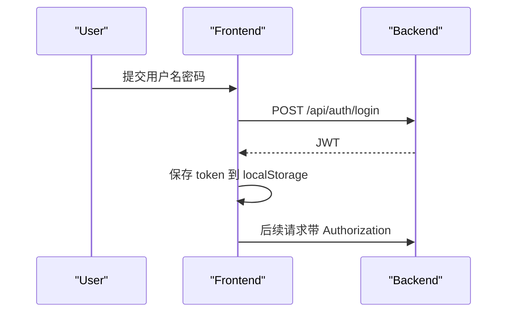
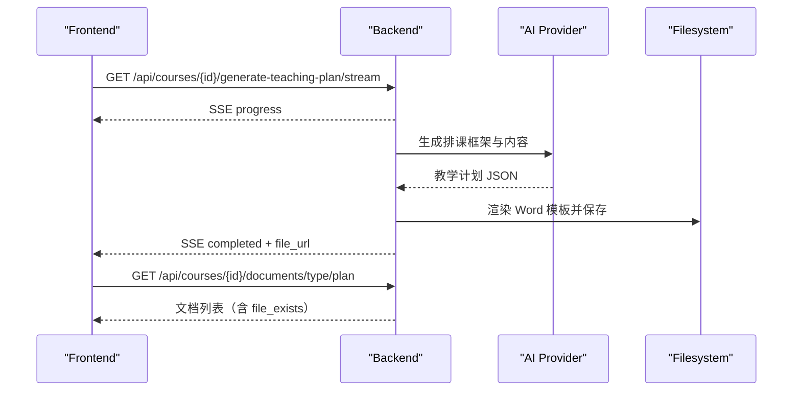
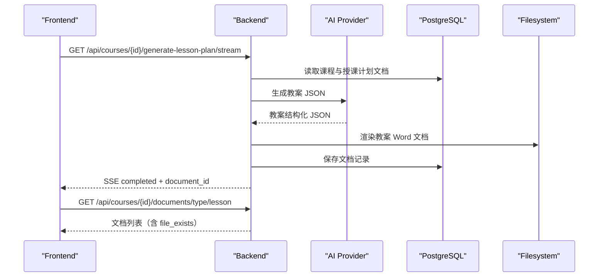
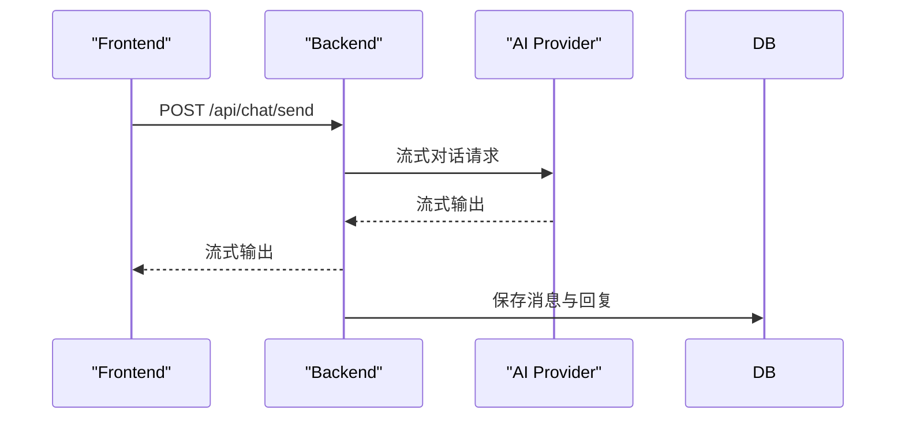

# 数据流分析

## 登录与鉴权

```mermaid
sequenceDiagram
  participant U as "User"
  participant FE as "Frontend"
  participant BE as "Backend"
  U->>FE: 提交用户名密码
  FE->>BE: POST /api/auth/login
  BE-->>FE: JWT
  FE->>FE: 保存 token 到 localStorage
  FE->>BE: 后续请求带 Authorization
```

## 授课计划生成

```mermaid
sequenceDiagram
  participant FE as "Frontend"
  participant BE as "Backend"
  participant AI as "AI Provider"
  participant FS as "Filesystem"
  FE->>BE: GET /api/courses/{id}/generate-teaching-plan/stream
  BE-->>FE: SSE progress
  BE->>AI: 生成排课框架与内容
  AI-->>BE: 教学计划 JSON
  BE->>FS: 渲染 Word 模板并保存
  BE-->>FE: SSE completed + file_url
  FE->>BE: GET /api/courses/{id}/documents/type/plan
  BE-->>FE: 文档列表（含 file_exists）
```

## 教案生成

```mermaid
sequenceDiagram
  participant FE as "Frontend"
  participant BE as "Backend"
  participant AI as "AI Provider"
  participant DB as "PostgreSQL"
  participant FS as "Filesystem"
  FE->>BE: GET /api/courses/{id}/generate-lesson-plan/stream
  BE->>DB: 读取课程与授课计划文档
  BE->>AI: 生成教案 JSON
  AI-->>BE: 教案结构化 JSON
  BE->>FS: 渲染教案 Word 文档
  BE->>DB: 保存文档记录
  BE-->>FE: SSE completed + document_id
  FE->>BE: GET /api/courses/{id}/documents/type/lesson
  BE-->>FE: 文档列表（含 file_exists）
```

## AI 对话

```mermaid
sequenceDiagram
  participant FE as "Frontend"
  participant BE as "Backend"
  participant AI as "AI Provider"
  FE->>BE: POST /api/chat/send
  BE->>AI: 流式对话请求
  AI-->>BE: 流式输出
  BE-->>FE: 流式输出
  BE->>DB: 保存消息与回复
```
